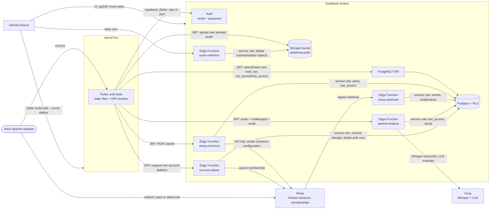
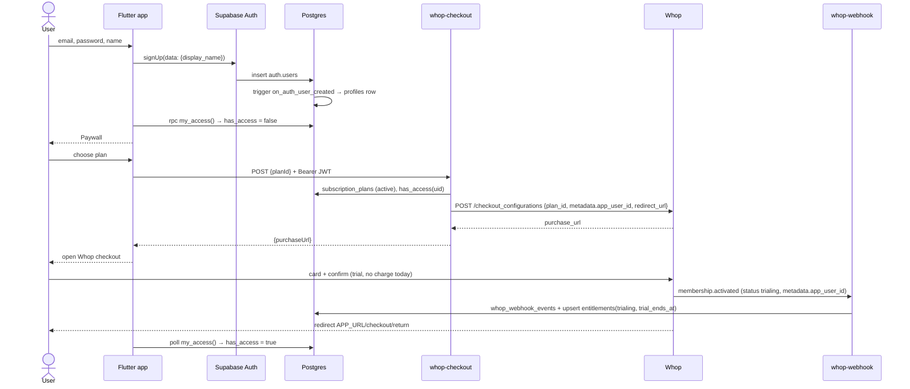
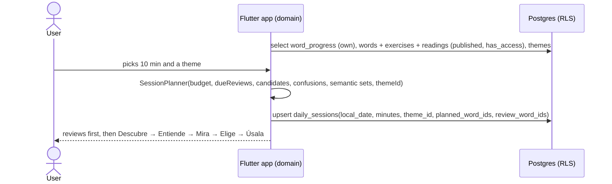
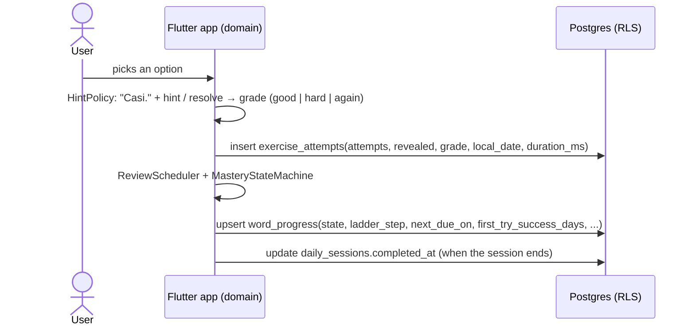
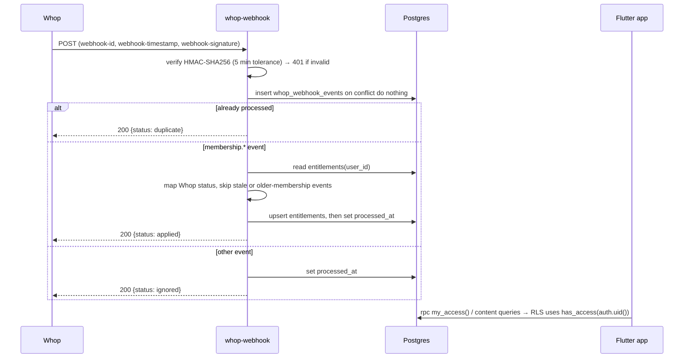

# Architecture

flui is a Flutter app (web first) backed by Supabase. There is **no custom backend**: the app talks
to Supabase Auth and Postgres directly, Row Level Security protects every table, and a small set of
Edge Functions talks to Whop for payments and Groq for speech analysis. Domain logic runs in pure
Dart on the client.

flui is a daily oral-expression gym: every learning surface (a mandatory spoken diagnosis, the daily
plan, the ENTRENAR training lab, vocabulary review, quick practice) ends in the user speaking, through
one shell-owned mic (`core/mic`) — never a per-screen record button. See ADR-0006 for the training
engine's decisions in full.

Decisions and trade-offs: [ADRs](adr/). Product rules: [learning-method.md](learning-method.md).

## 1. System context



## 2. Components

| Component | Responsibility | Trust boundary |
|-----------|----------------|----------------|
| Flutter app (`app/`) | UI, session/training planning, grading, mastery, streaks, voice metrics (pure Dart), one shell-owned mic, persistence through Supabase | Untrusted client. Holds only the publishable (anon) key and the user JWT. |
| Supabase Auth | Email/password accounts (Google later), JWT issuance | Managed |
| Postgres + RLS (`supabase/migrations`) | Content (words + challenges), learning/training data, entitlements, access + quota functions | Enforces who reads and writes what |
| `whop-checkout` Edge Function | Verifies the user JWT, looks up the plan, creates a Whop checkout configuration with `metadata.app_user_id` | Holds `WHOP_API_KEY` |
| `whop-webhook` Edge Function | Verifies the Standard Webhooks signature, stores events idempotently, updates `entitlements` | Holds `WHOP_WEBHOOK_SECRET`; only writer of entitlements |
| `speech-analyze` Edge Function | Verifies access and the daily quota before any paid call, resolves the prompt by `challengeId` server-side, calls Groq (`mode=analyze`: Whisper + LLM; `mode=transcribe`: Whisper only), sanitizes the response | Holds the Groq API key; the only caller of Groq |
| `audio-retention` Edge Function | Daily cron: deletes `speaking-audio` objects past the 90-day milestone window or orphaned (24 h grace), never one a `stored` row still references | Holds `AUDIO_RETENTION_SECRET`; service role only |
| `account-delete` Edge Function | Fail-closed self-service deletion: cancels the Whop membership, removes the user's storage, deletes the auth user | Service role; only path that deletes an `auth.users` row on request |
| Whop | Product, 2 recurring plans (30 and 90 days) with a 7-day trial, hosted checkout, card collection, membership cancellation | External |
| Groq | Whisper transcription and LLM evaluation for speaking attempts | External |
| Vercel Pro | Serves the prebuilt Flutter web bundle | Static hosting only |
| GitHub Actions | CI, web build and deploy, Supabase keep-alive, daily audio-retention cron | Holds deploy secrets |

## 3. App flow (first run)


- Router guard: signed out → Welcome; signed in and `my_access().has_access == false` → Paywall;
  signed in, access granted and no `skill_profiles` row yet → the diagnosis (mandatory, pausable back
  to its own intro, never skippable outright).
- The webhook can arrive after the redirect. On `/checkout/return`, poll `my_access()` (for example
  every 2 s for up to 60 s) and then offer a retry. Do not trust query parameters on the return URL.
- On app start and on resume, refresh `my_access()`; if access ended, route to the Paywall.
- HOY itself no longer requires a persisted daily-session row first (D41): it shows duration chips
  and a provisional plan, and persists on START or the first mic press. The classic word-review
  daily session (Descubre → Mira → Elige → Úsala) keeps its own separate time-budget ask
  (`/today/time`), unchanged by the diagnosis or the chips card.

## 4. Data flows

### 4.1 Sign-up → trial



### 4.2 Daily session



### 4.3 Exercise attempt → progress



### 4.4 Checkout → webhook → entitlement → access



Whop → flui status mapping: `trialing` → `trialing`; `active`, `canceling` → `active`;
`past_due`, `unresolved` → `past_due`; `completed`, `expired` → `expired`; `canceled` → `canceled`;
`drafted` and unknown → ignored. Only `trialing` and `active` within `current_period_end` grant access.

## 5. Data model


### Training-engine tables (added by ADR-0006, not shown in the ERD above)

| Table | Purpose |
|-------|---------|
| `challenges` | Training/diagnosis prompts, seeded from `content/challenges/*.yml`; readable by any authenticated user once `published` (no access gate — content is not the cost). |
| `speaking_attempts` | Append-only: one row per analyzed spoken attempt (`context` in diagnosis/daily/lab/word/quick), transcript, metrics, sanitized observations, audio status/path. Word-exercise answers are never inserted here (D37). |
| `skill_profiles` | One row per diagnosis (id = the diagnosis session id); closes that diagnosis. A trigger sets `kind` (baseline/retake) and rejects a retake under 30 days. |
| `speech_analysis_usage` | The daily analysis quota ledger (`claim_speech_analysis`), service-role only. |
| `daily_sessions` (additive columns) | `focus_area`, `challenge_id`, `woven_word_ids` — the speaking goal woven into the same row the word plan already used. |
| `profiles` (additive column) | `audio_retention_consent` — null until asked; gates the `speaking-audio` bucket's insert policy alongside the row's own `pending` status. |

`speaking-audio` (private bucket, 2 MiB/object): key `<uid>/<attempt_id>.<ext>`; insert requires the
matching attempt row to be `pending`, the context to be diagnosis or a weekly milestone, and consent
`true`. `select`/`delete` are own-folder only; there is no `update`.

### Access rules

| Table / function | anon | authenticated | service role |
|------------------|------|---------------|--------------|
| `profiles` | — | select own; update own `display_name` only | all |
| `words`, `word_confusions`, `exercises`, `exercise_options`, `readings`, `word_themes` | — | select published content **only when `has_access()`** | all |
| `themes` | — | select published rows (the taxonomy is the shape of the offer, not the paid content) | all |
| `daily_sessions`, `word_progress` | — | select, insert, update own rows | all |
| `exercise_attempts`, `streak_repairs` | — | select, insert own rows (append-only) | all |
| `subscription_plans` | select active | select active | all |
| `entitlements` | — | select own | all (webhook) |
| `whop_webhook_events` | — | — | all |
| `has_access(uid)` | — | execute (own uid only) | execute |
| `my_access()` | — | execute | execute |

Enforced invariants: every exercise has exactly 3 options and exactly 1 correct (deferred constraint
trigger); a sentence contains exactly one `{{blank}}`; distractors carry type, `why_not` and
`hint_specific`; a revealed attempt is graded `again`.

### Access functions

```sql
public.has_access(uid uuid default auth.uid()) returns boolean
-- true when entitlements.status in ('trialing','active')
-- and (current_period_end is null or current_period_end > now())

public.my_access() returns json
-- { "has_access": bool,
--   "entitlement_status": "trialing"|"active"|"past_due"|"canceled"|"expired"|null,
--   "current_period_end": timestamptz|null,
--   "trial_ends_at": timestamptz|null }   -- only while trialing
```

### Edge Function contracts

| Function | Request | Success | Errors (`{error: {code, message}}`) |
|----------|---------|---------|--------------------------------------|
| `POST /functions/v1/whop-checkout` | `Authorization: Bearer <user JWT>`, body `{"planId": "monthly" \| "quarterly"}` | `200 {"purchaseUrl": "https://whop.com/checkout/..."}` | 400 `invalid_body`, 401 `unauthorized`, 403 `origin_not_allowed`, 404 `unknown_plan`, 405, 409 `already_subscribed`, 502 `upstream_error`, 500 `internal_error` |
| `POST /functions/v1/whop-webhook` | Whop Standard Webhooks headers + raw JSON | `200 {"status": "applied" \| "duplicate" \| "ignored" \| "skipped", "reason"?}` | 401 `invalid_signature`, 400 `invalid_payload`, 500 (Whop retries) |
| `POST /functions/v1/speech-analyze` | `Authorization: Bearer <user JWT>`, body `{audio (base64), mimeType, durationMs, challengeId?, mode?: "analyze"\|"transcribe"}` | `200` analyze: `{analysis:{summary,structure,vocabulary,strength,retryCue}, observations:[...]}`; transcribe: `{text, durationMs, words}` | 400 `invalid_body`/`invalid_audio`/`unknown_challenge`, 401, 403 `access_required`, 413 `payload_too_large`, 422 `no_speech`, 429 `rate_limited`/`daily_limit_reached`, 502 `upstream_error`, 503 `access_unavailable` |
| `POST /functions/v1/account-delete` | `Authorization: Bearer <user JWT>` | `200 {"status": "deleted"}` | 401, 502 `billing_unavailable`, 404 `whop_membership_not_found`, 500 |
| `audio-retention` (cron only, `Authorization: Bearer <AUDIO_RETENTION_SECRET>`) | — | `200 {"deleted": N, "failed": N}` | 401, 500 |

## 6. Flutter app structure

Feature-first, with Clean Architecture layers inside each feature.

```text
app/lib/
  main.dart, bootstrap.dart   # config parsing, backend selection (fake | supabase), DI overrides
  app/                  # FluiApp, router + guards, FluiBottomBar/NavigationRail shell, top-level pages
  core/                 # app-wide infrastructure: config, clock, theme tokens, Supabase client,
                        # error/Result types, l10n (app_es.arb). No feature imports.
                        # audio/  — SpeechRecorder/SpeechPlayer ports, HoldToRecord (pure)
                        # mic/    — MicController, MicTargetRegistry, MicTarget contracts (pure) +
                        #           presentation/ (MicButton, MicDock, notices — the only recorder UI)
  shared/               # reusable UI (atoms, molecules) and pure helpers. No feature imports.
  features/
    auth/               # sign-up, sign-in, sign-out, session stream
    onboarding/         # welcome and intro slides (benefits + a real-word micro-lesson)
    subscription/       # plans, my_access, paywall, checkout return polling
    diagnosis/          # the mandatory 3-slot spoken diagnosis, pause/resume, skill_profiles
    daily/              # HOY: budget-free chips + provisional plan, SessionPlanner, daily_sessions,
                        # the word daily session (Descubre/Mira/Elige/Úsala)
    training/           # the training-engine domain (Challenge, BehaviorCode, TrainingLoop,
                        # TrainingPlanner, Progression, DiagnosisProfiler) and ENTRENAR + quick
                        # practice presentation; data/ for challenges, speaking_attempts, audio store
    speaking/           # SpeechAnalysisRepository (speech-analyze client), SpeechTranscript
    themes/             # theme taxonomy, recommender (catalog order), neighbours, "Explorar"
    vocabulary/         # catalog, word detail, mastery state machine, review scheduling, exercises
                        # (cloze, form recall, production — all spoken through the shell mic)
    reading/            # "En contexto" scenes
    profile/            # "Tu progreso": streaks, evidence, playback, audio settings, account,
                        # account deletion
      domain/           # entities, value objects, use cases, repository interfaces (pure Dart)
      data/             # Supabase data sources, DTOs, repository implementations
      presentation/     # Riverpod notifiers (view models), screens (containers), widgets (presentational)
```

**Dependency rule:** `presentation → domain ← data`. `domain` imports no Flutter, Supabase or
Riverpod code. `data` implements `domain` interfaces. Features talk to each other only through
another feature's `domain` API. Screens (containers) read providers; widgets receive plain values
and callbacks. `core/audio` and `core/mic` import no feature (checked by an architecture test);
widgets never own recorder, permission or timer logic — they forward pointer/keyboard events to
`MicController` and render its `states`/`notices`/`levels`.

Stack (for reference): Flutter 3.47.4, Dart 3.13, `material_ui`, Riverpod 3 + generator,
go_router 18, freezed 4, `supabase_flutter`, `very_good_analysis`, `mocktail`, gen-l10n (es).

## 7. Testing strategy

| Layer | Tool | What it proves | Runs in |
|-------|------|----------------|---------|
| Domain (Dart) | `flutter test` unit tests | Session planner, ladder, grading, hint policy, mastery, streaks (tables in learning-method.md) | `app-ci.yml` |
| Presentation | widget tests with provider overrides, `mocktail` | Screens render states, one primary action, copy | `app-ci.yml` |
| Flows | `integration_test` | Sign-up → paywall → session against a local stack | local / later CI |
| Database | pgTAP (`supabase/tests/database`) | RLS for every table, access truth table, triggers, content invariants, seed quality, account-deletion cascade, audio-retention selection | `supabase-ci.yml` |
| Edge Functions | `deno test` (`supabase/functions/**/_test.ts`) | Signature verification, event mapping, CORS, validation, access/quota gating (both `speech-analyze` modes), account-delete's fail-closed order, handler behavior with fakes | `supabase-ci.yml` |

## 8. Environments and configuration

| Environment | Supabase | Whop | App URL |
|-------------|----------|------|---------|
| local | `supabase start` (API `http://127.0.0.1:54421`) | sandbox (`https://sandbox-api.whop.com/api/v1`) | `http://localhost:3000` |
| dev (optional) | separate Supabase project | sandbox | Vercel preview |
| prod | production Supabase project | production (`https://api.whop.com/api/v1`) | Vercel production domain |

- **App config** is compile-time via `--dart-define-from-file=config/<env>.json` with the keys
  `SUPABASE_URL` and `SUPABASE_ANON_KEY` (the publishable key; safe for clients because RLS protects
  data). `app/config/*.json` is git-ignored; `*.example.json` templates are committed. CI writes a
  temporary file from GitHub secrets.
- **Function secrets** live only in Supabase (`supabase secrets set`) or in the git-ignored
  `supabase/functions/.env` locally. See [deployment.md](deployment.md). The training engine adds
  `GROQ_API_KEY` (`speech-analyze`), `AUDIO_RETENTION_SECRET` (shared between `audio-retention` and
  the GitHub Actions cron that calls it), `SPEECH_ANALYZE_DAILY_LIMIT` (optional; unset means
  unlimited), and a `WHOP_API_KEY` scoped for `membership:cancel` (`account-delete`, ADR-0004
  decision 9).
