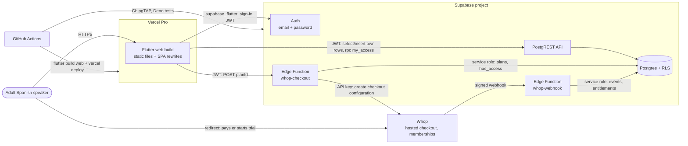
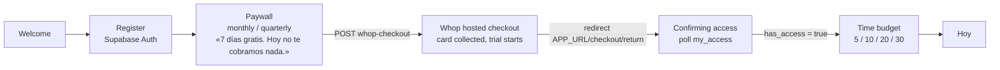
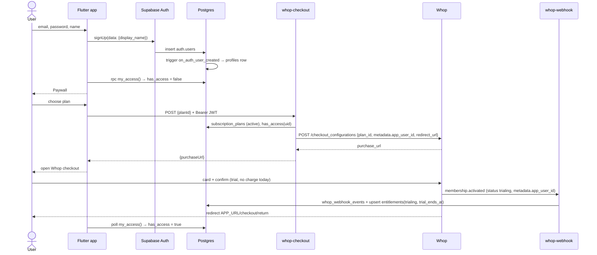
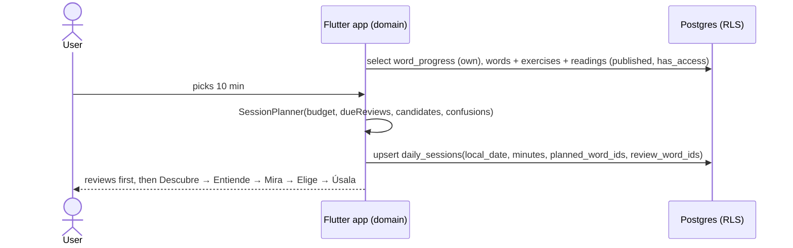
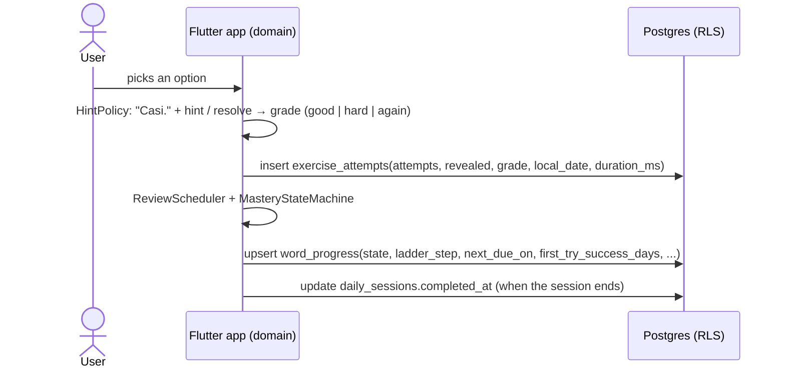
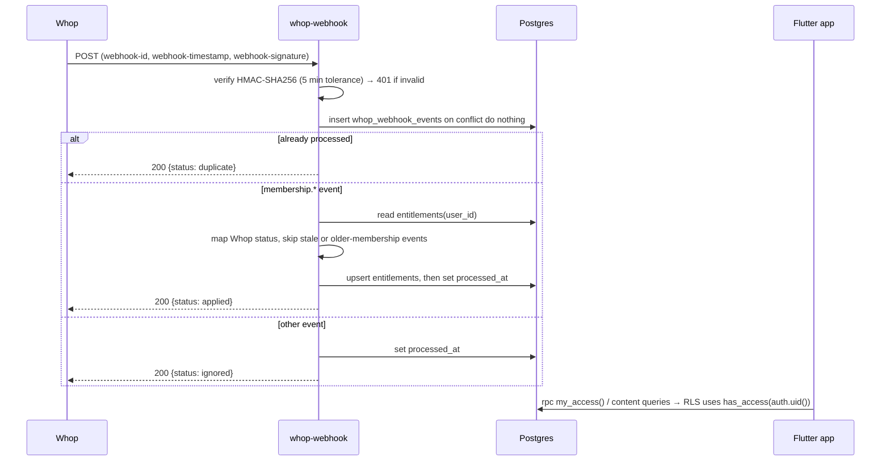
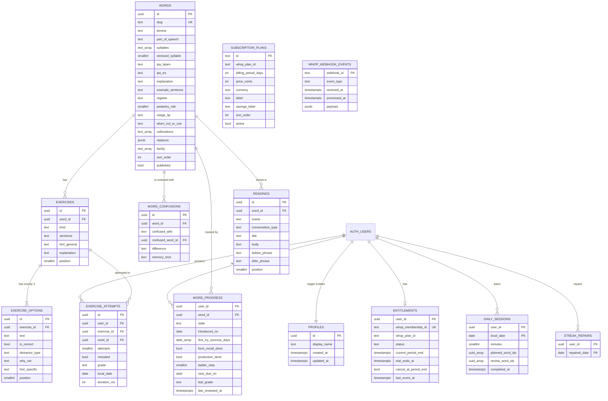

# Architecture

flui is a Flutter app (web first) backed by Supabase. There is **no custom backend**: the app talks
to Supabase Auth and Postgres directly, Row Level Security protects every table, and one small
Edge Functions area talks to Whop for payments. Domain logic runs in pure Dart on the client.

Decisions and trade-offs: [ADRs](adr/). Product rules: [learning-method.md](learning-method.md).

## 1. System context



## 2. Components

| Component | Responsibility | Trust boundary |
|-----------|----------------|----------------|
| Flutter app (`app/`) | UI, session planning, grading, mastery, streaks (pure Dart), persistence through Supabase | Untrusted client. Holds only the publishable (anon) key and the user JWT. |
| Supabase Auth | Email/password accounts (Google later), JWT issuance | Managed |
| Postgres + RLS (`supabase/migrations`) | Content, learning data, entitlements, access functions | Enforces who reads and writes what |
| `whop-checkout` Edge Function | Verifies the user JWT, looks up the plan, creates a Whop checkout configuration with `metadata.app_user_id` | Holds `WHOP_API_KEY` |
| `whop-webhook` Edge Function | Verifies the Standard Webhooks signature, stores events idempotently, updates `entitlements` | Holds `WHOP_WEBHOOK_SECRET`; only writer of entitlements |
| Whop | Product, 2 recurring plans (30 and 90 days) with a 7-day trial, hosted checkout, card collection | External |
| Vercel Pro | Serves the prebuilt Flutter web bundle | Static hosting only |
| GitHub Actions | CI, web build and deploy, Supabase keep-alive | Holds deploy secrets |

## 3. App flow (first run)



- Router guard: signed out → Welcome; signed in and `my_access().has_access == false` → Paywall.
- The webhook can arrive after the redirect. On `/checkout/return`, poll `my_access()` (for example
  every 2 s for up to 60 s) and then offer a retry. Do not trust query parameters on the return URL.
- On app start and on resume, refresh `my_access()`; if access ended, route to the Paywall.

## 4. Data flows

### 4.1 Sign-up → trial



### 4.2 Daily session



### 4.3 Exercise attempt → progress



### 4.4 Checkout → webhook → entitlement → access



Whop → flui status mapping: `trialing` → `trialing`; `active`, `canceling` → `active`;
`past_due`, `unresolved` → `past_due`; `completed`, `expired` → `expired`; `canceled` → `canceled`;
`drafted` and unknown → ignored. Only `trialing` and `active` within `current_period_end` grant access.

## 5. Data model



### Access rules

| Table / function | anon | authenticated | service role |
|------------------|------|---------------|--------------|
| `profiles` | — | select own; update own `display_name` only | all |
| `words`, `word_confusions`, `exercises`, `exercise_options`, `readings` | — | select published content **only when `has_access()`** | all |
| `daily_sessions`, `word_progress` | — | select, insert, update own rows | all |
| `exercise_attempts`, `streak_repairs` | — | select, insert own rows (append-only) | all |
| `subscription_plans` | select active | select active | all |
| `entitlements` | — | select own | all (webhook) |
| `whop_webhook_events` | — | — | all |
| `has_access(uid)` | — | execute (own uid only) | execute |
| `my_access()` | — | execute | execute |

Enforced invariants: every exercise has exactly 3 options and exactly 1 correct (deferred constraint
trigger); a sentence contains exactly one `{{blank}}`; distractors carry type, `why_not` and
`hint_specific`; a revealed attempt is graded `again`.

### Access functions

```sql
public.has_access(uid uuid default auth.uid()) returns boolean
-- true when entitlements.status in ('trialing','active')
-- and (current_period_end is null or current_period_end > now())

public.my_access() returns json
-- { "has_access": bool,
--   "entitlement_status": "trialing"|"active"|"past_due"|"canceled"|"expired"|null,
--   "current_period_end": timestamptz|null,
--   "trial_ends_at": timestamptz|null }   -- only while trialing
```

### Edge Function contracts

| Function | Request | Success | Errors (`{error: {code, message}}`) |
|----------|---------|---------|--------------------------------------|
| `POST /functions/v1/whop-checkout` | `Authorization: Bearer <user JWT>`, body `{"planId": "monthly" \| "quarterly"}` | `200 {"purchaseUrl": "https://whop.com/checkout/..."}` | 400 `invalid_body`, 401 `unauthorized`, 403 `origin_not_allowed`, 404 `unknown_plan`, 405, 409 `already_subscribed`, 502 `upstream_error`, 500 `internal_error` |
| `POST /functions/v1/whop-webhook` | Whop Standard Webhooks headers + raw JSON | `200 {"status": "applied" \| "duplicate" \| "ignored" \| "skipped", "reason"?}` | 401 `invalid_signature`, 400 `invalid_payload`, 500 (Whop retries) |

## 6. Flutter app structure

Feature-first, with Clean Architecture layers inside each feature.

```text
app/lib/
  core/                 # app-wide infrastructure: config, router, theme tokens, Supabase client,
                        # error/Result types, l10n setup. No feature imports.
  shared/               # reusable UI (atoms, molecules) and pure helpers. No feature imports.
  features/
    auth/               # sign-up, sign-in, session
    access/             # my_access, paywall, checkout return polling
    session/            # time budget, SessionPlanner, daily_sessions
    practice/           # exercise flow, hint policy, grading, attempts
    words/              # catalog, word detail, mastery state machine
    progress/           # streaks, weekly consistency, stats
      domain/           # entities, value objects, use cases, repository interfaces (pure Dart)
      data/             # Supabase data sources, DTOs, repository implementations
      presentation/     # Riverpod notifiers (view models), screens (containers), widgets (presentational)
```

**Dependency rule:** `presentation → domain ← data`. `domain` imports no Flutter, Supabase or
Riverpod code. `data` implements `domain` interfaces. Features talk to each other only through
another feature's `domain` API. Screens (containers) read providers; widgets receive plain values
and callbacks.

Stack (for reference): Flutter 3.47.4, Dart 3.13, `material_ui`, Riverpod 3 + generator,
go_router 18, freezed 4, `supabase_flutter`, `very_good_analysis`, `mocktail`, gen-l10n (es).

## 7. Testing strategy

| Layer | Tool | What it proves | Runs in |
|-------|------|----------------|---------|
| Domain (Dart) | `flutter test` unit tests | Session planner, ladder, grading, hint policy, mastery, streaks (tables in learning-method.md) | `app-ci.yml` |
| Presentation | widget tests with provider overrides, `mocktail` | Screens render states, one primary action, copy | `app-ci.yml` |
| Flows | `integration_test` | Sign-up → paywall → session against a local stack | local / later CI |
| Database | pgTAP (`supabase/tests/database`) | RLS for every table, access truth table, triggers, content invariants, seed quality | `supabase-ci.yml` |
| Edge Functions | `deno test` (`supabase/functions/**/_test.ts`) | Signature verification, event mapping, CORS, validation, handler behavior with fakes | `supabase-ci.yml` |

## 8. Environments and configuration

| Environment | Supabase | Whop | App URL |
|-------------|----------|------|---------|
| local | `supabase start` (API `http://127.0.0.1:54421`) | sandbox (`https://sandbox-api.whop.com/api/v1`) | `http://localhost:3000` |
| dev (optional) | separate Supabase project | sandbox | Vercel preview |
| prod | production Supabase project | production (`https://api.whop.com/api/v1`) | Vercel production domain |

- **App config** is compile-time via `--dart-define-from-file=config/<env>.json` with the keys
  `SUPABASE_URL` and `SUPABASE_ANON_KEY` (the publishable key; safe for clients because RLS protects
  data). `app/config/*.json` is git-ignored; `*.example.json` templates are committed. CI writes a
  temporary file from GitHub secrets.
- **Function secrets** live only in Supabase (`supabase secrets set`) or in the git-ignored
  `supabase/functions/.env` locally. See [deployment.md](deployment.md).
