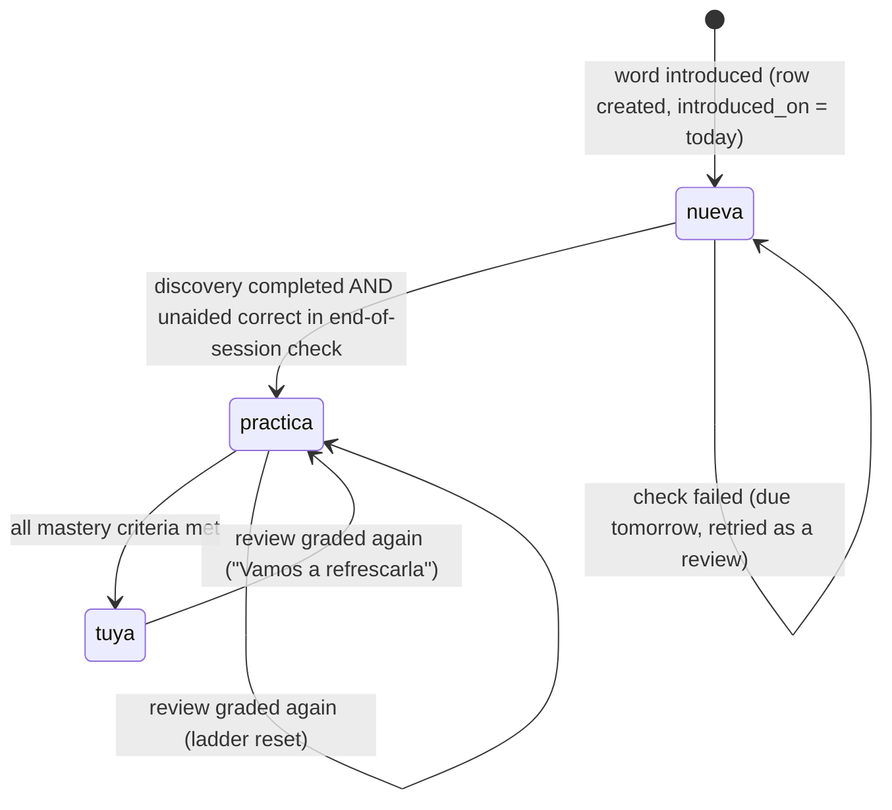

# Learning method

The product rules of flui, specified so they can be implemented and unit-tested in pure Dart
(`app/lib/features/*/domain`). Evidence and sources: [research/domain.md](research/domain.md).

> **Scope.** These rules run in the client (see [ADR 0003](adr/0003-domain-logic-in-dart-client.md))
> and persist through RLS-protected tables (`daily_sessions`, `word_progress`, `exercise_attempts`,
> `streak_repairs`). Dates are **local calendar dates** in the user's time zone.

## At a glance

| Rule | Value |
|------|-------|
| Time budgets offered | 5, 10, 20, 30 minutes (preselect yesterday's choice) |
| Cost of one review | 0.5 min |
| Cost of one new word | 7 min |
| New words per day | at most 3 |
| Review ladder | 1 → 3 → 7 → 14 → 30 days |
| Grades | first try = `good`, second try = `hard`, forced reveal = `again` |
| Options per cloze | 3 (1 correct, 2 typed distractors) |
| Forced reveals before easy mode | 3 per session |
| Confusable words | never introduced within 7 days of each other |
| Words of one semantic set | never introduced within 7 days of each other |
| Themes offered per day | 3 recommended + "Explorar" + "Sorpréndeme" |
| Themes kept as "tus temas" | at most 3; changing theme any day is free |
| Weekly streak repair | 1 free repair per ISO week |

---

## 1. Session planner

### Inputs

| Input | Source |
|-------|--------|
| `budgetMinutes` | user choice: 5, 10, 20 or 30 (DB accepts 5–60) |
| `today` | local date |
| `dueReviews` | `word_progress` rows with `next_due_on <= today` |
| `candidates` | published words without a `word_progress` row, ordered by `sort_order` |
| `recentIntroductions` | `word_progress` rows with `introduced_on >= today - 6` |
| `confusions` | `word_confusions` rows (see §7) |
| `semanticSets` | `words.semantic_set_id` (see §7) |
| `themeId` | user choice, or none; filters **candidates only** (see §10) |
| `practiceWords` | words in `practica`, for the theme cascade (see §10) |
| `neighbourThemeIds` | themes nearest to `themeId` by shared words (see §10) |

### Constants

```dart
const reviewMinutes = 0.5;
const newWordMinutes = 7;
const maxNewWordsPerDay = 3;
const afianzarThreshold = 0.5; // share of the budget
```

### Algorithm

1. **Order reviews:** oldest `next_due_on` first, then lower `ladder_step`, then `sort_order`.
2. **Cap reviews to the budget:** `plannedReviews = min(dueReviews.length, floor(budgetMinutes / reviewMinutes))`.
   Reviews that do not fit stay due for tomorrow.
3. `reviewTime = plannedReviews * reviewMinutes`.
4. **New word slots:**
   - `budgetMinutes == 5` → `newSlots = 0` (reviews only).
   - otherwise `newSlots = min(floor((budgetMinutes - reviewTime) / newWordMinutes), maxNewWordsPerDay)`.
5. **"Hoy toca afianzar":** if `reviewTime > afianzarThreshold * budgetMinutes`, then
   `afianzar = true` and `newSlots = min(newSlots, 1)`.
6. **Pick new words:** walk `candidates` in order and take a candidate only if neither interference
   rule of §7 holds against any word in `recentIntroductions` or already picked today. Stop at
   `newSlots`. When a theme is chosen, walk only the candidates tagged with it, then the cascade of
   §10. The theme changes nothing else: not `newSlots`, not the afianzar threshold, not the ladder,
   and never the due-review queue.
7. **Empty plan:** if `plannedReviews == 0` and no new word was picked, return an empty plan.
   With a 5-minute budget the UI suggests 10 minutes ("Con 10 minutos te presento una palabra nueva.").
8. Persist `daily_sessions(local_date, minutes, theme_id, planned_word_ids, review_word_ids)`.
   Choosing a different budget **or a different theme** on the same day recomputes and updates the
   row; the two answers are symmetric.

### Session order

1. Due reviews (one cloze each, mixed across topics).
2. New words, each through **Descubre → Entiende → Mira → Elige → Úsala**.
3. End-of-session check: one cloze per new word with a sentence not used earlier that session.
4. Re-queued items (§3).

### Test table

| Budget | Due reviews | Review time | Formula | Afianzar | New words |
|-------:|------------:|------------:|--------:|:--------:|----------:|
| 5 | 0 | 0 | — | no | 0 (empty plan) |
| 5 | 4 | 2 | — | no | 0 |
| 5 | 12 | 5 (10 planned) | — | yes | 0 |
| 10 | 0 | 0 | ⌊10/7⌋ = 1 | no | 1 |
| 10 | 4 | 2 | ⌊8/7⌋ = 1 | no | 1 |
| 10 | 12 | 6 | ⌊4/7⌋ = 0 | yes | 0 |
| 20 | 2 | 1 | ⌊19/7⌋ = 2 | no | 2 |
| 20 | 22 | 11 | ⌊9/7⌋ = 1 | yes | 1 |
| 30 | 0 | 0 | ⌊30/7⌋ = 4 → cap 3 | no | 3 |
| 30 | 32 | 16 | ⌊14/7⌋ = 2 → cap 1 | yes | 1 |
| 30 | 40 | 20 | ⌊10/7⌋ = 1 | yes | 1 |

---

## 2. Grading and review ladder

### Grades

| Outcome of a cloze | `attempts` | `revealed` | `grade` |
|--------------------|-----------:|:----------:|---------|
| Correct on the first try | 1 | false | `good` |
| Correct on the second try | 2 | false | `hard` |
| Two wrong answers, third option forced | 3 | true | `again` |

Every answered exercise inserts one `exercise_attempts` row (append-only). Only the **first
exercise of a word in a review** updates its schedule; re-queued attempts are recorded but do not
change the ladder again.

### Ladder

```dart
const ladderDays = [1, 3, 7, 14, 30];
```

`word_progress.ladder_step` is the index (0–4) of the interval used for the next review.

| Event | `ladder_step` | `next_due_on` |
|-------|---------------|---------------|
| Word moves to `practica` (§5) | 0 | `today + 1` |
| Review graded `good` | `min(step + 1, 4)` | `today + ladderDays[newStep]` |
| Review graded `hard` | unchanged | `today + ladderDays[step]` |
| Review graded `again` | 0 | `today + 1` |

Intervals always count from the day the review actually happens, so overdue words are not
penalized twice. Example: introduced on day 0 → due day 1 → `good` → due day 4 → `good` → day 11
→ `good` → day 25 → `good` → day 55 → then every 30 days.

Each review also sets `last_grade` and `last_reviewed_at`, and a `good` review adds `today` to
`first_try_success_days` (distinct dates only).

---

## 3. Hint and retry policy ("pista, no respuesta")

Wrong options are marked **"Casi."**, disabled, and never revealed as the answer.

| Step | UI | Data |
|------|----|------|
| Wrong answer #1 | "Casi." + `exercises.hint_general` | — |
| Wrong answer #2 | "Casi." + `exercise_options.hint_specific` of the option just chosen | — |
| Third choice | Only the correct option remains; the user taps it ("¡Ahí está!") | `attempts = 3`, `revealed = true`, `grade = again` |
| After any resolution | Show `exercises.explanation`; on a forced reveal also show `why_not` of both distractors | — |

- **Re-queue once.** A forced reveal re-queues the word at the end of the session with another
  exercise of the same word (a sentence not shown today). If that attempt is not first-try correct,
  stop: the word is due tomorrow. If no unused exercise exists, do not re-queue.
- **Frustration cap.** After **3 forced reveals** in one session, stop presenting clozes: postpone
  new words not yet started, cancel pending re-queues, and switch the rest of the session to
  reading mode (Mira) with the message "Hoy estás sembrando; mañana cosechas."
- Rewards and scheduling use **first-try accuracy only**; hint-assisted answers earn no reward.

### Form recall (typed answer)

- Prompt: the word's `explanation` plus a sentence with the word masked.
- Normalize input and target: lowercase, trim, remove diacritics.
- Accept an exact normalized match with the lemma or a family/inflected form. Tolerate a
  Levenshtein distance of 1 only when the expected form has **6 or more letters**, so short words
  are not accepted as near neighbours.
- Up to 2 hints (the second reveals the first letter), then reveal. Accepted without reveal →
  `form_recall_done = true`.

### Production ("Úsala")

The user writes a sentence (at least 4 words) for a situation built from the word's first
`replaces` pair. It is accepted when it uses the word (any inflection) and the user confirms the
self-check rubric ("¿Suena natural?"): right meaning, natural register. Accepted →
`production_done = true`. Real-world use ("¿La usaste hoy?") is a badge only and never gates mastery.

---

## 4. Word states

| State | Label in UI | Meaning |
|-------|-------------|---------|
| `nueva` | Nueva | Introduced, not yet retrieved unaided |
| `practica` | Practica | Being consolidated with spaced reviews |
| `tuya` | Tuya ("Ya es tuya") | Active vocabulary |

## 5. Mastery state machine



### Exact criteria

**`nueva` → `practica`** — both:
1. The discovery flow was completed (Descubre, Entiende, Mira, Elige and Úsala all visited).
2. One **first-try** correct answer in the end-of-session check (a sentence not seen earlier that
   session). A `nueva` word that fails is due tomorrow; a first-try success in that review moves it
   to `practica`.

**`practica` → `tuya`** — evaluated after every review; all of:
1. `first_try_success_days` has **≥ 3 distinct dates** (review days only, not the introduction day).
2. `max(first_try_success_days) - min(first_try_success_days) >= 7 days`.
3. `form_recall_done == true` (≥ 1 form recall).
4. `production_done == true` (≥ 1 production).
5. `last_grade == 'good'` (the most recent review was first-try correct).

**`tuya` → `practica`** — a review graded `again`. Keep all history (success days, flags); never
reset to `nueva`. The word returns to `tuya` once criteria 1–5 hold again after a `good` review.

### Test table (`practica` → `tuya`)

| Success days | Span | Form recall | Production | Last grade | Result |
|--------------|-----:|:-----------:|:----------:|:----------:|--------|
| 1, 4, 11 | 10 | yes | yes | good | `tuya` |
| 1, 4, 7 | 6 | yes | yes | good | `practica` (span < 7) |
| 1, 11 | 10 | yes | yes | good | `practica` (< 3 days) |
| 1, 4, 11 | 10 | no | yes | good | `practica` |
| 1, 4, 11 | 10 | yes | no | good | `practica` |
| 1, 4, 11 | 10 | yes | yes | hard | `practica` |

---

## 6. Streak and weekly consistency

- **Active day:** a local date with at least one `exercise_attempts` row, a `daily_sessions` row with
  `completed_at`, or a `streak_repairs` row. Any activity counts, even a 3-minute review.
- **Week:** ISO week (Monday–Sunday) in the user's time zone.
- **Primary display:** "N de 7 días" = active days in the current week.
- **Streak:** consecutive active days ending today, or ending yesterday if today has no activity yet.
- **Free repair:** at most **one per ISO week** (counted by the week of `repaired_date`). It can fill
  one missed day within the last 7 days and is offered, never sold. No guilt copy and no guilt
  notifications.

---

## 7. Interference rules

Two rules keep a candidate out of today's plan. Both use the same 7-day window, and both apply to
words introduced earlier today as well as to `recentIntroductions`.

**Paronyms.** Two words **A** and **B** are *confusable* when a `word_confusions` row of either word
points to the other one, by `confused_word_id` or by a case-insensitive match of `confused_with`
with the other word's `lemma`.

**Semantic sets.** Two words are *in the same set* when they share a non-empty
`words.semantic_set_id`. A semantic set is a synonym, antonym or category-mate group. Tinkham
(1993, 1997) and Nation (2000) found that words presented as such a set are learned more slowly than
the same words presented apart, because the shared meaning makes them compete at retrieval; the same
research found **thematic** or scenario clusters harmless. That is exactly why a *theme* (§10) is
not a semantic set: it groups words by the situation you use them in, never by the meaning they
share, so choosing a theme never slows the words it exists to teach.

A candidate is **not introduced** while any word it interferes with has `introduced_on >= today - 6`.
A "contraste" exercise for a confusable pair unlocks only when one of the pair is in `practica` with
≥ 2 first-try success days (future feature).

---

## 8. Word selection criteria

A word enters the catalog only if **all** pass:

1. Useful in 3 or more everyday areas (work, social, interviews, family).
2. Replaces a frequent vague word, *comodín* or filler ("cosa", "tema", "hacer", "muy bueno").
3. Mid-frequency: users probably recognize it but rarely use it.
4. Pan-Hispanic, or regional variants are documented.
5. Pedantry risk ≤ 2 (1 = natural, 3 = sounds affected).
6. Explainable with common words.
7. Not confusable with another word planned for the same week.

Favor verbs that replace "hacer/poner/tener" and adjectives that sharpen praise or evaluation.
Avoid prestige words that sound affected ("solaz", "inexorable").

## 9. Content-writing guidelines

| Element | Rule |
|---------|------|
| `explanation` | Original, ≤ 20 words, common vocabulary, no circular definitions |
| `example_sentence` | A natural adult situation, "tú" register when addressing the user |
| `replaces` | 2–3 real before → after pairs from everyday speech |
| `word_confusions` | ≥ 1, each with a one-line difference and a memory trick |
| Cloze exercises | 3 per word, a **new sentence** each, exactly one defensible answer |
| Options | 1 correct + 2 distractors typed `paronym`, `near_synonym` or `register` |
| `hint_general` | < 25 words, points at meaning, never at spelling |
| `hint_specific` | Contrast for that distractor, phrased as a nudge, never the answer |
| `why_not` | Declarative: why that distractor fails in this sentence |
| `explanation` (exercise) | Names the answer and why **each** distractor fails |
| Readings | 3 per word in different scenes, tagged with conversation type, with before → after phrases |
| Language | Neutral pan-Hispanic Spanish, "tú", no regional slang; regional usage is variation, not error |
| Voice | Follow [brand.md](brand.md): no "lección", "examen", "incorrecto"… |

### Legal and quality guardrails

- **Original definitions only.** RAE's legal notice forbids reproducing or extracting its content for
  commercial use. Use the DLE and the DPD only to check correctness, never as a source.
- **No "#SinMuletillas"** in names or copy: it is a registered trademark of Giselle Barceló.
- **No ShareAlike data** (e.g. Wiktionary, CC BY-SA) in core content.
- **AI-drafted content requires human linguistic review** before `published = true` in production.
  The starter seed in `supabase/seed.sql` is AI-drafted and must be reviewed before launch.
- A register distractor must be clearly wrong *in that context* (e.g. bureaucratic "finiquitar" at a
  family lunch), so the exercise still has exactly one right answer.

---

## 10. Themes

A theme ("¿sobre qué tema?") is the second half of the daily choice. It answers one question and
only one: **which new word shows up today**.

### What a theme does not touch

The due-review queue stays global and lands on its computed dates, whatever theme is chosen.
Reordering a schedule around a filter is what Anki's own documentation warns filtered decks do to a
collection, and Bjork's desirable difficulties are the reason that spacing is worth protecting. A
theme also never changes `newSlots`, the "Hoy toca afianzar" threshold, or the ladder.

### Exhaustion cascade

A chosen theme runs out of new words long before the catalog does, and an empty day would punish the
user for choosing. So, in order:

| Step | When | What happens | What the user is told |
|------|------|--------------|-----------------------|
| a | the theme has no new candidate, but the user has words of it in `practica` | today recombines those words; the ladder is untouched, because this is practice, not a review pulled forward | "Hoy no me quedan palabras nuevas de {tema}. Afianzamos las que ya tienes de ese tema." |
| b | no words in `practica` either | the nearest theme by **shared-word overlap** over the whole catalog lends its next word | "Hoy no me quedan palabras nuevas de {tema}. Te traigo una de {otro}: se usa igual." |
| c | no neighbour has one either | the next catalog word comes in | the same line, naming the theme that word does belong to, or "Te traigo otra que te sirve igual." when it belongs to none |

Both interference rules of §7 still apply at every step. The substitution is never silent: a user who
picked "Entrevistas" is told when the word came from somewhere else.

### Autonomy over lock-in

- No minimum streak on a theme. Changing it any day is free, and the plan is recomputed exactly as a
  changed budget recomputes it.
- The daily prompt offers **3 recommended** themes plus "Explorar" and "Sorpréndeme". Patall, Cooper
  and Robinson (2008) found the motivational benefit of choice largest at two to four options;
  Scheibehenne, Greifeneder and Todd (2010) then showed that longer lists are not actively harmful,
  merely not more helpful — so the full list is a door, not the front of the screen.
- "Tus temas" holds **at most 3**.
- Recommendations are ranked from the two pre-signup answers (`ThemeRecommender`): where the user's
  words let them down maps to a theme family, and how they want to sound nudges it. Ties keep catalog
  order, so the prompt never shuffles between two builds of the same screen.
- A theme with no content behind it is `soon` and is never offered: an empty theme is a promise the
  catalog cannot keep.
